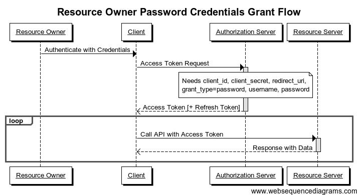

# API Guidelines

## Topics
- [1 Resources](#1-resources)
  - [1.1 URLs](#11-urls)
  - [1.2 Naming conventions](#12-naming-conventions)
    - [1.2.1 Resource URLs](#121-resource-urls)
    - [1.2.2 Resource properties (state)](#122-resource-properties-state) 
  - [1.3 Date and time](#13-date-and-time)
- [2 Standard methods](#2-standard-methods)
  - [2.1 Filtering](#21-filtering)
  - [2.2 Pagination](#22-pagination)
    - [2.2.1 Request](#221-request)
    - [2.2.2 Response](#222-response)
  - [2.3 Examples](#23-examples)
    - [2.3.1 List](#231-list)
    - [2.3.2 Get](#232-get)
  - [2.4 Status codes](#24-status-codes)
    - [2.4.1 Empty Collection](#241-empty-collection)
  - [2.5 Expansion](#25-expansion) 
    - [2.5.1 Example](#251-example)
    - [2.5.2 References](#252-references)
- [3 Errors](#3-errors)
  - [3.1 Error payload](#31-error-payload)
- [4 Security](#4-security)
  - [4.1 OAuth2](#41-oauth2)
    - [4.1.1 Resource owner password credentials grant](#411-resource-owner-password-credentials-grant)
    - [4.1.2 Client credentials grant](#412-client-credentials-grant)
  - [4.2 Scoping](#42-scoping)
- [6 Licensing and throttling etc](###-6-Licensing-and-throttling-etc)
- [5 Versioning](#5-versioning)
- [6 API documentation](#7-api-documentation)

## 1 Resources
There are two kinds of resources:
* **Collections** are a list of resources of the _same type_.
* A single **Resource** has some state (properties) and zero or more sub-resources.

### 1.1 URLs
URL scheme to access the resources is as follows:
* **Collections:** http://awesomeapi/resources _(e.g http://awesomeapi/cards)_
* **Resource:** http://awesomeapi/resources/:resource_id _(e.g. http://awesomeapi/cards/4321567812345678)_
* **Sub-resource:** http://awesomeapi/resource/:resoure-id/sub-resource _(e.g. http://awesomeapi/customer/9876/cards)_

### 1.2 Naming conventions

#### 1.2.1 Resource URLs
As a rule of thumb, resource names must be **plural nouns** in most cases. E.g:
* http://awesomeapi/cards _(returns list of cards)_
* http://awesomeapi/customers/4210909 _(returns one customer with id 4210909)_
* http://awesomeapi/customers/4210909/cards _(returns list of cards for customer with ID 4210909)_

Verbs should only be used when we can't use a noun for that operation e.g. `calculate`.

#### 1.2.2 Resource properties (state)
Resource properties should follow **camelCase** convention e.g:
```
{
    "fullName": "Mehmood Ahmed",
    "homeAddress": "Gulshan-e-Iqbal, Karachi",
    ...
}
``` 
### 1.3 Date and time
Date and time should follow [ISO 8601](https://en.wikipedia.org/wiki/ISO_8601) format e.g. 2012-01-01T12:00:00Z.

## 2 Standard methods
Each resource can support one or more of CRUD operations. These operations are often performed by means of HTTP verbs.

|Method|Http verb|Http request body|Http response body|Http Success Code|
|-|-|-|-|-|
|List|GET \<collection URL>|Empty|Resource list|200 (OK)
|Get|GET \<resource URL>|Empty|Resource|200 (OK)
|Create|POST \<collection URL>|Resource|Resource|201 (Created)
|Update|PUT \<resource URL>|Resource|Resource|200 (OK)
|Delete|DELETE \<resource URL>|Resource|Empty|204 (No Content)
|Partial Update|PATCH \<resource URL>|Json Patch Document|Resource|200 (OK)

### 2.1 Filtering
Filtering is mostly applicable on `List` method and **must** be done through **query string parameters**. E.g.
```
GET http://awesomeapi/customers/421909/accounts?type=current
```
The above call will return all Current accounts of customer with ID `421909`.

### 2.2 Pagination
#### 2.2.1 Request
Use `page` and `pageSize` parameters (**optional**) in query string for restricting number of records returned from API. E.g. 
```
GET http://awesomeapi/transactions?page=1&pageSize=20
``` 
will return _first 20 transactions_ from transactions resource.

#### 2.2.2 Response
`List` method response **must** have `values` and `totalSize` properties. The structure **must** comply to following:
```
{
    "values": [
        {...},
        {...}
    ],
    "totalSize": 1000, 
}
```

### 2.3 Examples
#### 2.3.1 List
```
GET http://awesomeapi/customers?page=2&pageSize=50
```
The response for the above call should look something like:
```
{
    "values": [
        { "cardNumber": "4565789009875432", ...},
        { "cardNumber": "4565789009875432", ...}
    ],
    "totalSize": 1000
}
```

#### 2.3.2 Get
```
GET http://awesomeapi/customers/421909
```
The response for the above call should look something like:
```
{
    "fullName": "Ahmed Khan",
    "phoneNumber": "...",
    ...,
}
```

### 2.4 Status codes
All successful operations **must** return HTTP `2xx` status code. For **Create** method, Http code `201` **must** be returned if resource is created successfully.

For more, refer to this [link](http://www.restapitutorial.com/httpstatuscodes.html).

#### 2.4.1 Empty Collection
Http code `200 (OK)` must be returned in such cases with response body having empty list. In case no resources are found against the filter criteria or pagination provided, Http code `404 (Not Found)` should be returned.

### 2.5 Expansion
Often, a resource is required to provide succint as well as detailed information through some kind of query parameter. This is commonly known as expansion in REST world and it is achieved by supporting an `expand` parameter in request query. 

#### 2.5.1 Example
Let's suppose we have an API `GET http://awesomeapi/customers/:customer_id/accounts/:account_id` that returns a user's bank account. The default response for this API could look like:
```
{
  "id": "ihndh1002388jpqoeAJD",
  "name": "Scooby",
  "linkedCards": "http://awesomeapi/customers/091029/accounts/ihndh1002388jpqoeAJD/cards",
  "limits: "http://awesomeapi/customers/091029/accounts/ihndh1002388jpqoeAJD/limits",
}
```
However, if the consumer wants to have `linkedCards` and `limits` in a single call, it can simply use the `expand` paramter in query to get the full dataset. The URL will look something like:
`GET http://awesomeapi/customers/:customer_id/accounts/:account_id?expand=linkedCards,limits`

The expanded response could look like:
```
{
  "id": "ihndh1002388jpqoeAJD",
  "name": "Scooby",
  "linkedCards": [
    { "cardNumber": "4565789009875432", ...},
    { "cardNumber": "4565789009875432", ...}  
  ],
  "limits: [
    { "dailyWithdrawal": 50000, ...}
    { "monthlyWithdrawal": 1000000, ...}
    { "monthlyPurchase": 1000000, ...}
  ],
}
```
#### 2.5.2 References
- [3 ways to make your API responses flexible](https://zapier.com/engineering/flexible-api-responses/)
- [Expansions in REST API](https://developer.atlassian.com/server/confluence/expansions-in-the-rest-api/)

## 3 Errors
Http error codes `4xx` must be used for error responses.

### 3.1 Error payload
Error response should be a json object containing an `error` property. This property is an object that **must** contain `code`, `message` properties in it. Optionally, this object contains a `target` property which is generally the name of the field that contains the error. There can be also be a `details` property that is a collection of `error` objects. E.g:
```
{
  "error": {
    "code": "BadArgument",
    "message": "Multiple errors in ContactInfo data",
    "target": "ContactInfo",
    "details": [
      {
        "code": "NullValue",
        "target": "PhoneNumber",
        "message": "Phone number must not be null"
      },
      {
        "code": "NullValue",
        "target": "LastName",
        "message": "Last name must not be null"
      },
      {
        "code": "MalformedValue",
        "target": "Address",
        "message": "Address is not valid"
      }
    ]
  }
}
``` 
## 4 Security
_Contents of this section will be updated soon_

### 4.1 OAuth2
Depending on the client, there are two types of grants that common for APIs exposed by most enterprise applications.

#### 4.1.1 Resource owner password credentials grant
With this type of authorization, the credentials (and thus the password) are sent to the client and then to the authorization server. It is therefore imperative that there is absolute trust between these two entities. It is mainly used when the client has been developed by the same authority as the authorization server.



#### 4.1.2 Client credentials grant
This type of authorization is used when the client is himself the resource owner. There is no authorization to obtain from the end-user.


### 4.2 Scoping
_TBD_

## 6 Licensing and throttling etc
_TBD_

## 7 Versioning
Backward compatibility is a key aspect of an API. Versioning **must** be done for already published APIs which are enhanced overtime and it could be required to keep multiple versions of the functionality at the same time. 

## 8 API documentation
For documentation, [Swashbuckle plugin](https://github.com/domaindrivendev/Swashbuckle) **must** be used. Swashbuckle plugin lets us sync code and documentation without the need of manually creating Swagger json/yaml files and duplicating the documentation through comments. For this to work properly though, all **public** API functions must have well formed comments which will be utilized by Visual Studio's Xml document genrator module. 


